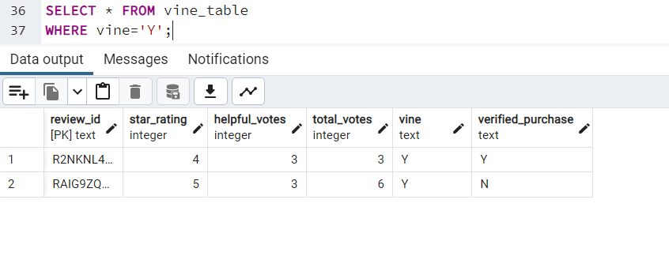
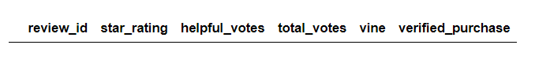
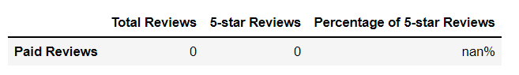
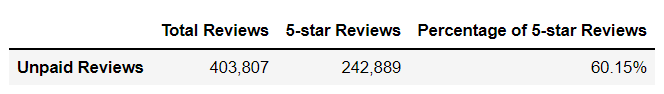

# **Amazon Vine Analysis**

## **Overview**
Analyze an Amazon reviews dataset to determine if there is any bias toward favorable reviews written by members of the paid Amazon vine program. The Amazon Vine program is a service that allows manufacturers and publishers to receive reviews for their products. Companies pay a small fee to Amazon and provide products to Amazon Vine members, who are then required to publish a review. 

For this particular analysis the scope has been narrowed down to reviews written for books. As there are thousands of reviews, PySpark will be used to perform the ETL process and Pandas will then be used to perform an analysis on the processed data.

## **Results**
In order to pick reviews that are more likely to be helpful the dataset was filtered using the following parameters:
- Total Votes must be greater than or equal to 20.
- Percentage of helpful votes to total votes must be greater than or equal to 50%. 

As seen in Figure 1, there are only two records in the dataset that are Vine reviews. However, neither fall within the filters set for this data analysis resulting in zero Vine review results being available for this analysis. Therefore, the remainder of this section will focus only on non-Vine reviews.

 

    
    Figure 1 (Vine Reviews SQL Results)

 

 

     
     
    Figure 2 (Vine Reviews DataFrame and Summary) 

 

Q. How many Vine reviews and non-Vine reviews were there? 
A. There was a total of 403,807 non-Vine reviews.

 

Q. How many Vine reviews were 5 stars? How many non-Vine reviews were 5 stars? 
A. 242,889 non-Vine reviews were 5 star reviews.

 

Q. What percentage of Vine reviews were 5 stars? What percentage of non-Vine reviews were 5 stars?  
A. 60.15% of all non-Vine reviews were 5 star reviews.

 

 

     
    Figure 3 (Non-Vine Reviews Summary) 

 

## **Summary**
There is not enough data to conclusively determine if there is a bias toward favorable reviews written by members of the paid Amazon vine program since there are only two reviews written as part of the program. However, if a determination must be made, then based on the information that is available, there is no bias between paid and non-paid reviews as 50% of vine program reviews have a 5-star rating which is comparable to the 60% found in non-paid reviews. 

In order to better make a detrmination, it would be recommended to replicate this analysis with a different product type that is known to have a substantial amount of paid reviews or expand the scope of the analysis to include more product categories.